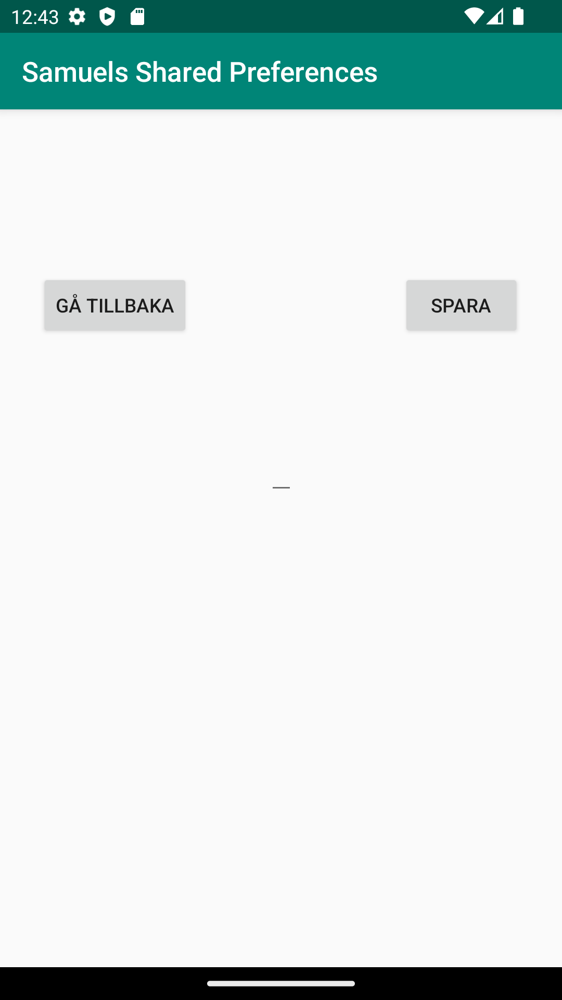

# Rapport

**Skriv din rapport här!**
    
Först så skapade jag en till activity, MainActivity2. Sedan deklarerade jag de variabler som skulle 
användas och gjorde layouten till uppgiften. Denna uppgift så skulle man använda sharedPreferences. 
Laoutens olika widgets mm lokaliserades med find by id. Dena andra activityn har en edittext samt två knappar. 
En som sparar och en som går tillbaka till föregående activity. 

    knapp.setOnClickListener(new View.OnClickListener() {
    @Override
    public void onClick(View v) {
    SharedPreferences.Editor editor = preferences.edit();
    editor.putString("name", namn.getText().toString());
    editor.apply();
    }
    });

Koden ovanför är den som är skriven i MainActivity2. Denna kod tar den texten som inmatas m.h.a getText.

